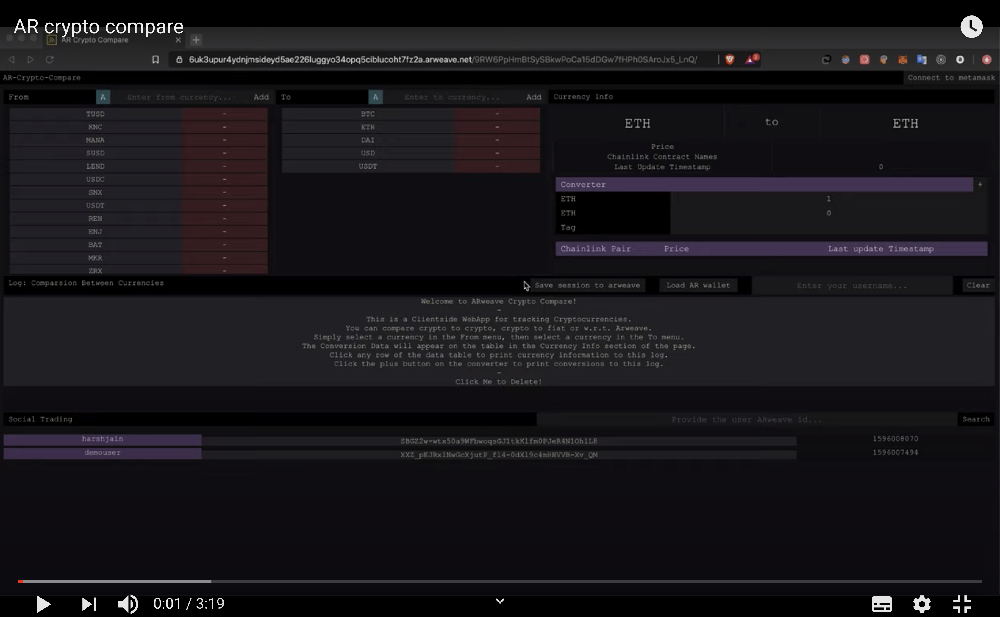

## AR Crypto Compare

This permaweb is built for arweave. AR crypto compare is a social trading platform, for learning from the strategies followed by expert traders and positions they take on different assets..The app is available at [link](https://arweave.net/9RW6PpHmBtSySBkwPoCa15dDGw7fHPh0SAroJx5_LnQ).

It uses chainlink smart contract for fetching price of the pair. If there is no chainlink contract with price feed for that it combines different pairs for getting the price of the target.

For example:

```
MANA/BTC: contract with price feed for this pair don't exist. But MANA/ETH, ETH/USD, BTC/USD contract exist, so it combines them to get the price of target pair. It also shows the last time when the price for each underlying contract was updated, and the timestamp of target asset is the minimum of all underlying asset.
```

## Use case Video

[](https://www.youtube.com/watch?v=Tzh-nHvmP60)

It provides a beautiful UI which is divided in 3 sections:

- **Price fetch via chainlink contract**: Metamask is required to use injected web3. Ar-crypto-compare relies on metmask for fetching data from contracts. There is also a asset conversion and contract details subsection under this.

- **Log section**: Pairs' price that user want to monitoring , he can pin to this section. He can also load arweave for saving current session. This is useful for taking snapshots of your portfolio.

- **Social Trading**: Here , one can view the sessions or the portfolio of other users. By clicking or searching a specific user, the sessions or portfolio at different time of that users are loaded. Then one can view specific session he want to follow.
